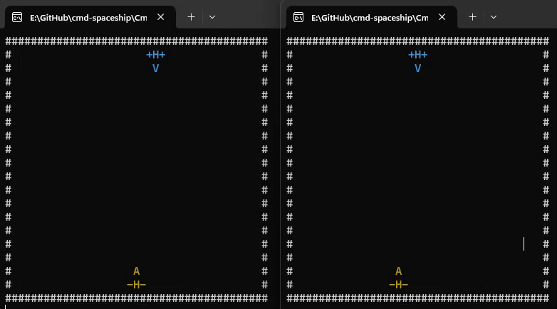

# CmdSpaceship
CmdSpaceship is a spaceship simple shooter game in command prompt settings. 
It was firstly written with `<pthread.h>` in Linux, and now fully rewritten with modern C++ as well as Winsock2 on Windows.

The code is evolved from a course material from Parallel Processing course in [Multimedia University](https://www.mmu.edu.my/) in 2015.

## Instruction
### Running the Application
1. Build both executable.
2. Run server first, then client.

### Gameplay
> AD to move, W to shoot.

## Roadmap
### 2025:
- Refactor and split manager classes. 
- Implement basic game loop and reset capabilities
- Upgrade to newer version of C++

### Old ReadMe.md remnant (Discovery/Mystery)
---
1. "kbhit()" and "getch()" is somehow cannot be run on std::thread. Initially it freezed almost completely, take more than 2 seconds to render one page of ternimal characters. Moving that to main thread stop the data stalls. 
2. std::mutex doesn't work if it is interact with something not in std::thread. Multiple crashes and fixed couple of them
3. Chrono doesn't seems very realible. Works with unoptimization off, doesn't work in optimization on. Replaced with Sleep(20) instead and position syncing is more realible locally. (100% not on remote machine)

## Reference
The winsock2 part I take references from :	

https://docs.microsoft.com/en-us/windows/win32/winsock/complete-server-code

https://docs.microsoft.com/en-us/windows/win32/winsock/complete-client-code

## Authors
[@hchia93](https://www.github.com/hchia93)
