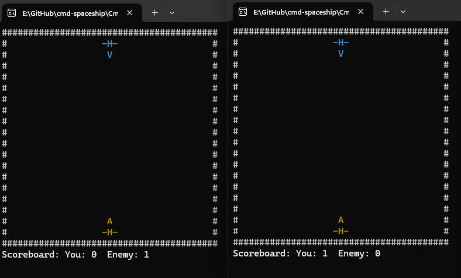

# cmd-spaceship


**cmd-spaceship** is a retro-inspired **command-line multiplayer shooter** built with modern `C++` and `Winsock2`.  
Originally based on a parallel processing coursework project (2015, Multimedia University), it has since been **rewritten from scratch** with contemporary coding practices and improved networking support, such as pooling implementation.

## ✨ Features

- **Modern C++ Rewrite** : Clean, maintainable codebase using RAII and STL instead of raw pthreads.
- **Client–Server Architecture** : Powered by Winsock2 with separate server and client builds.
- **Cross-Platform Heritage** : The original Linux pthreads version has been ported and modernized for Windows.
- **LiteWeight** : Runs directly in the command prompt for a nostalgic ASCII-game experience.



## Project Structure
```bash
cmd-spaceship/
├── CMakeLists.txt         # CMake build configuration
├── generate.bat           # Generate solution
├── README.md              # This file
├── src/                   # Source code
└── generated-vs/          # Generated Visual Studio solution
```

## Running the Project

### Step 1: Generate Solution

Execute the generator script. This will install dependencies and generate the Visual Studio solution:

```cmd
/generate.bat
```

The solution will be generated in

```cmd
/generated-vs/
```

### Step 2: Build Solutions

Open the generated solution located at:

```cmd
/generated-vs/cmd-spaceship.sln
```

> ⚠️ Ensure the start-up project is `cmd-spaceship-client` or  `cmd-spaceship-server` during build or debug.

### Step 3: Runs Executables 

1. Start the **server executable**. 
2. Run **client executables** to connect and play.

> ⚠️ If you launching from Visual Studio, kindly detach, reselect start up project, and relaunch.

## Game Controls

- `A` / `D` → Move left / right  
- `W` → Shoot  
- `R` → Restart after a spaceship is destroyed  

## 📚 References

- [Winsock2 Server Example](https://docs.microsoft.com/en-us/windows/win32/winsock/complete-server-code)  
- [Winsock2 Client Example](https://docs.microsoft.com/en-us/windows/win32/winsock/complete-client-code)  

