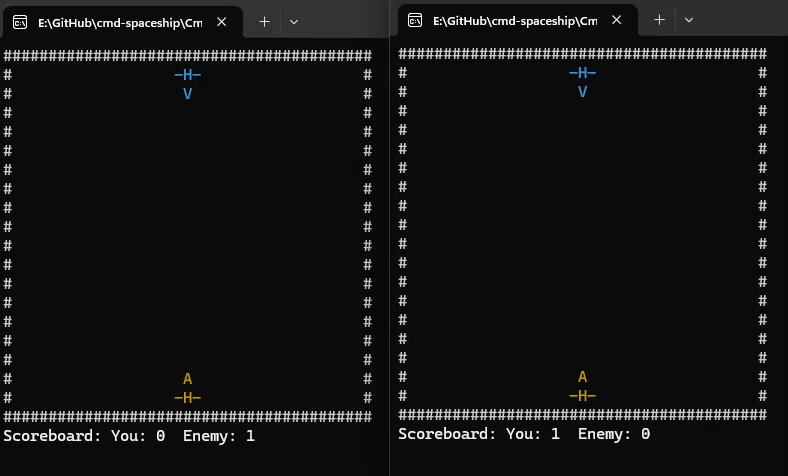

# cmd-spaceship

**cmd-spaceship** is a retro-inspired **command-line multiplayer shooter** built with modern `C++` and `Winsock2`.  
Originally based on a parallel processing coursework project (2015, Multimedia University), it has since been **rewritten from scratch** with contemporary coding practices and improved networking support.



## ✨ Features
- **Modern C++ Rewrite** – Clean, maintainable codebase using RAII and STL instead of raw pthreads.
- **Client–Server Architecture** – Powered by Winsock2 with separate server and client builds.
- **Cross-Platform Heritage** – The original Linux pthreads version has been ported and modernized for Windows.
- **Minimalist Gameplay** – Runs directly in the command prompt for a nostalgic ASCII-game experience.
- **Fast Iteration Demo** – Compact codebase suitable for learning and extending.

## 🚀 Build Instructions
- Build the **ServerBuild** and **ClientBuild** configurations.
- Executables can be found under:
```bash
..\src\CmdSpaceship\x64
```


## ▶️ Running
1. Start the **server executable**.
2. Run one or more **client executables** to connect and play.

## 🎮 Controls
- `A` / `D` → Move left / right  
- `W` → Shoot  
- `R` → Restart after a spaceship is destroyed  

## 📚 References
- [Winsock2 Server Example](https://docs.microsoft.com/en-us/windows/win32/winsock/complete-server-code)  
- [Winsock2 Client Example](https://docs.microsoft.com/en-us/windows/win32/winsock/complete-client-code)  

